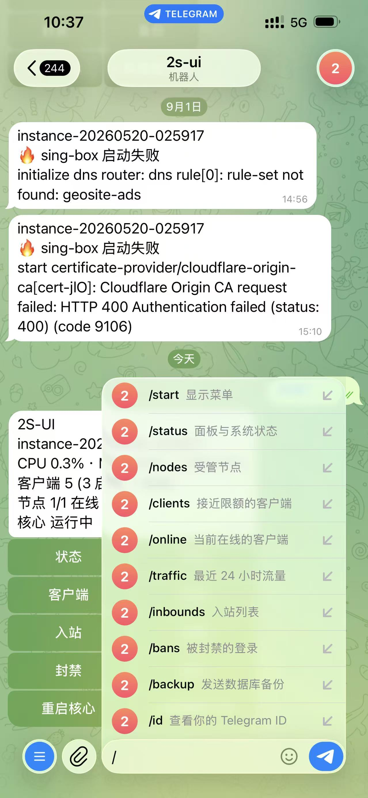

## Screenshots

### Main

### Inbounds

### Clients

### Edit Client

### Subscription QR

### DNS

### Drag and Drop Rules

### Traffic Chart

### Nodes (multi-node cluster)

### Settings — Domains & Certificates

### Settings — Interface

### Telegram Bot

